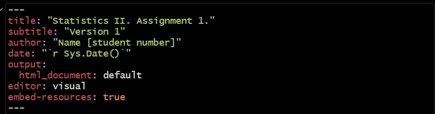
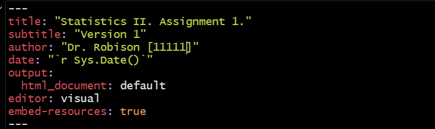
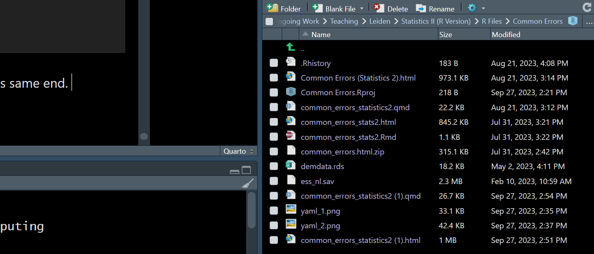
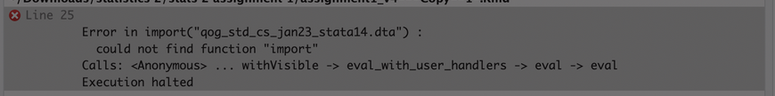

# Common Errors {#sec-common-errors}

```{r}
#| label: setup
#| echo: false
#| message: false
#| warning: false

#Load some of the packages used below
library(rio)
library(marginaleffects)
library(tidyverse)

#Loads data that is used below
dta <- import("data/demdata.rds")
ess <- import("data/ess_nl.sav")
```

This Appendix documents some of the most common errors that might arise when working with R in Statistics II. This document complements a similar one available for the operations introduced in Statistics I (see [here](https://poweleiden.github.io/statistics1/common_errors.html){target="_blank"})

If you are unsure where to look, try to search this document for any error message you get (using CTRL/CMD + F). If you cannot find your particular error in this document, then you can Google the error message that R produces as this can often turn up a potential solution.

## Your R assignment file (.rmd) won't knit to an html file

::: {.callout-warning title="The Problem"}
You are trying to knit your assignment and you receive an error such as "No such file or directory"; more generally, you cannot knit to an html
:::

The scenario: you have been successfully working through an R assignment in the .rmd file that was provided to you. However, you receive an error message such as "No such file or directory" when you try and "knit" the file to an html (i.e., ask R to convert the .rmd file into an html file). More generally, everything works while working in R Studio until you try to knit the final file.

There are a variety of potential causes for this problem. They perhaps share a common root though: when you ask R to "knit" a file, R will essentially from a blank slate and begin working *downwards* through your .rmd file. By blank slate, we mean that R will act as if you have not loaded any libraries or imported data or stored regression results (etc.) in the Environment and start running all the syntax that you have created to do these things. Here we'll discuss three ways this could short circuit the 'knitting' process. First, though, we'll note a general piece of advice:

::: {.callout-important title="Advice"}
Knit as you go!
:::

If you have had difficulties knitting a document before, we suggest "knitting as you go". Specifically, knit your .rmd file (convert it into an html) after every major section (e.g., after loading packages and your data, after question 1, after question 2...). Doing so may enable you to more quickly find, and troubleshoot, the specific problem affecting your file. For instance, if you can successfully knit your document after the first three questions of an assignment but have a problem after the fourth, then this implies that it is something specifically about the fourth question that is derailing the process. This can help you avoid spending unnecessary time and effort working through the earlier portions of the file.

### Incorrectly Specifying the "yaml"

::: {.callout-tip title="The Cause"}
The "yaml" has been incorrectly specified
:::

All .rmd documents begin with something called the "yaml". This is the portion of the document that lays out the basic attributes of the file you are trying to create: its title, author information, and other basic formatting details. Here is an example:



The "yaml" is the first thing that R deals with when knitting your file, so if there is a mistake here then the file won't be produced. We have seen three types of error in student submissions on this front:

-   Removing quotation marks: the title, author, and date information should all be enclosed within quotation marks. Removing them will lead to an error.

-   Adding information in the "sys.date()" area: "r sys.date()" is a specific snippet of syntax that tells R to use the date on your computer as the date in the html that is being produced. This general syntax is nice because it means we do not need to constantly update this line if we are working with a file over time. However, if you add information here (e.g., "r sys.date(27-09-2023"), then R will grind to a halt because this is not how the syntax works. In fact, we had to take special care formatting this bullet point because a mistake with writing out the "sys.date" information initially prevented this file from knitting to an html!

-   Adding additional options: For instance, we have seen students add something like "pdf: default" to the format area. R can knit to pdf files, but this requires some additional packages be installed to handle the conversion from an .rmd file to a .pdf file. Creating .pdf files can also be a little finicky as well. Adding this information can thus produce errors.

::: {.callout-note title="The Solution"}
Uh...don't do those things!
:::

More specifically, you should only make one change to the "yaml" area - you should update the author information to include your name and your student number while making sure that this information is provided in quotation marks. Everything else should be left as is.

As an example:



### Not Properly Importing Your Data {#sec-error-import}

::: {.callout-tip title="The Cause"}
You are manually loading data via the Files window rather than using syntax
:::

We load data into the R Environment, thereby enabling us to work with it, via syntax. Specifically, we use the `import()` function from the `rio` package:

```{r}
#| eval: false
#| error: true

library(rio)
ess <- import("ess_nl.sav")
```

We have seen some students take a different, and worse, route to this same end. Specifically, there is a "Files" window in R Studio that is typically presented in the bottom/right of the R Studio window, as so:



Here we can see that there are some data files within the working directory containing this .rmd file (e.g., "ess_nl.sav" or "demdata.rds"). We may be able to load this data by double clicking on the file and using the "Import Dataset" option that pops up. However, this is a **bad** idea. Remember that R begins working *downwards* within your .rmd file as it tries to knit it to an html. If you take this route to loading the data, then R will move through the yaml and fail to find the necessary syntax to load the `rio` package or to load your data via `import()`. It won't know that you have loaded the file manually because it is, per above, working in a type of blank slate environment. This is will almost certainly lead to lots of errors as R works through your file because you will be asking it to do things with data that it doesn't know exists since you are not including the necessary information within the .rmd file itself.

::: {.callout-note title="The Solution"}
Properly load your data.
:::

The solution is simple: use the appropriate syntax to load your data.

### Not loading libraries within the .rmd file

::: {.callout-tip title="The Problem"}
Performing operations outside of the .rmd file that are required for your analyses
:::

This is a more general version of the previous issue. For instance, perhaps you have loaded the `rio` library and correctly imported your data via syntax ... just not in the .rmd file (e.g., you may have entered these commands directly in the Console portion of R Studio or perhaps have run them from within an R Script that is separate from your .rmd file). The same problem would emerge: *you* would have access to the libraries and functions in question to work with while completing your assignment, but *R* *wouldn't* when it started to knit your document because it's not in the set of commands you're directly sending it.

One tip off here may be in the error message that R provides you. Consider the following error message taken from a student's error-prone .rmd file:



In this instance, the student is running into an issue with knitting. R provides us with information about the specific input that is causing a problem ("Error in import(....)") and the specific problem ("could not find function 'import'"). One way this error could emerge is if `rio` were loaded *outside* of the .rmd file (that is: the .rmd file does not contain `library(rio)` to load the library for use) such that R will have no idea where to find this command. (Another potential explanation for this error is below.)

::: {.callout-note title="The Solution"}
Keep all your steps in the same .rmd file
:::

This is a type of problem that can readily emerge, but also one that can be readily fixed: make sure you have included all of the relevant syntax in the .rmd file.

### Library/Package Conflicts

::: {.callout-tip title="The Cause"}
Two or more R libraries conflict with one another and have been loaded in such a way that this grinds R to a halt; packages loaded in an order that creates issues
:::

R libraries may sometimes feature identically named commands (e.g., both the `tidyverse`/`dplyr` and `car` libraries contain a function named `recode()`). In such instances, R will use the function from the library loaded most recently/last. This can create problems down the line; see @sec-ols-assumptions for more on this particular conflict.

Another way this could emerge is if the syntax for loading the library and syntax for using it are mis-ordered. This, for instance, would lead to an error:

```{r}
#| echo: false

#Detaching rio so that we can get an error below
detach("package:rio", unload=TRUE)
```

```{r}
#| error: true
#| eval: true

demdata <- import("demdata.rds")
library(rio)
```

R would try and use the `import` function here, but an error would emerge because the library from which this command originates has not been loaded at that point and, hence, R will not know how to act.

::: {.callout-note title="The Solution"}
Load relevant libraries at the start of the R document and pay attention to potential conflicts
:::

We recommend you begin your assignment by reading it in full to understand all of the steps that you will need to accomplish and then loading all of the relevant libraries at the start of the document so that R will know what it has accessible to use in later portions. This should be done in a way that does not introduce conflicts. Here we note two particular sources of conflict, both with the `tidyverse` library:

-   `expss`
-   `car`

We recommend loading these libraries *before* loading the `tidyverse` library to avoid conflicts (or, if necessary, taking one of the other strategies for avoiding conflict discussed in @sec-ols-assumptions ).

```{r}
#| echo: false

#re-loading rio::import
library(rio)
```

## "contrasts can be applied only to factors with 2 or more levels" {#sec-contrasts-can-be-applied-only-to-factors-with-2-or-more-levels}

::: {.callout-warning title="The Problem"}
You are trying to perform a regression model with a binary and/or categorical predictor variable and receive an error: "Error in `contrasts<-`(`*tmp*`, value = contr.funs\[1 + isOF\[nn\]\]) : contrasts can be applied only to factors with 2 or more levels"
:::

We include binary/categorical variables in a regression model by first converting that variable into a factor variable. R will then include the appropriate number of indicators in the model for us. Here is an example where we are trying to predict the level of voter turnout in a country (`vt_parl`) based on whether the country was a democracy or autocracy in the year 2007 (`demo2007`). Notably, we get an error that prevents the model from being performed.

```{r}
#| echo: false

#creating a factor variable for the example: 
dta <- dta |> 
  mutate(
    demo2007 = factor(TYPEDEMO2007, 
                      levels = c(0, 2), 
                      labels = c("Autocracy", "Democracy"))
  )
  
  
```

```{r}
#| error: true


# Run the model
demo_model <- lm(vt_parl ~ demo2007, data = dta)

demo_model
```

::: {.callout-tip title="The Cause"}
There was an error in the factor creation process that resulted in the variable only having non-NA values for one of the two factor levels.
:::

In this example, `demo2007` was a factor version of a variable named `TYPEDEMO2007`. Here are the properties of that variable:

```{r}
attributes(dta$TYPEDEMO2007)
table(dta$TYPEDEMO2007, useNA = "always")

```

The original variable is a numeric variable with two values: 0 (referring to autocracies) and 1 (referring to democracies). There are then 26 observations with missing (\<NA\>) data on the variable.

Here is the syntax that was used to create the factor variable used in the model above:

```{r}
#| eval: false

#creating a factor variable for the example: 
dta <- dta |> 
  mutate(
    demo2007 = factor(TYPEDEMO2007, 
                      levels = c(0, 2), 
                      labels = c("Autocracy", "Democracy"))
  )
  
```

The issue is in the `levels = c()` portion of the syntax. Instead of using the numeric values of 0 and 1, we instead used 0 and 2. However, if the `levels = c()` portion does not match the original values of the variable that we are converting to a factor, then observations with the non-matched values will be given an NA value on the new variable (see @sec-factor-command). We can see this here:

```{r}
levels(dta$demo2007)
table(dta$demo2007, useNA = "always")
table(dta$demo2007, dta$TYPEDEMO2007, useNA = "always")

```

The 104 observations on `TYPEDEMO2007` with a value of 1 all have an <NA> value on the new variable. Our regression model thus runs into a problem it cannot solve: we have asked it to compare the average value of the DV in situations where the IV equals "Democracy" and where in situations where it equals "Autocracy"...but there are no observations in the former case to use in the comparison!

::: {.callout-note title="Solution"}
Do not overwrite variables when creating new ones and double check your work!
:::

Nobody is perfect, so sometimes errors will creep into our efforts to recode variables or convert them to factor variables. There are two, interrelated, things we can do to minimize these problems. First, we can create new variables rather than overwriting the initial data when we are recoding a variable or converting it to a factor variable. Second, we can investigate the variables that we have created to double check that things look the way that we expect them to. The first thing here facilitates the second thing: if we overwrite the initial variable, then we do not have a "ground truth" to which we can compare the new variable. We also cannot fix our mistake without fully re-loading our data and then working through all our data cleaning syntax again. On the other hand, if we do not overwrite our initial data, then we can easily check our work and, if we do see a mistake, fix and re-run simply that portion of the syntax.

## Not seeing the right number of categories for factor variables in regression models {#sec-not-seeing-the-right-number-of-categories-for-factor-variables-in-regression-models}

::: {.callout-warning title="The Problem"}
You tried to convert a categorical variable into a factor variable but only one coefficient is present in the regression output
:::

We include categorical variables in a regression model by first converting the variable into a factor variable. R will then include the appropriate number of indicators in the model for us. For instance, if we have a categorical variable with four levels, then R will include three indicators in the model if we successfully convert the variable into a factor variable.

Suppose we have a numeric variable in our dataset corresponding to the gross domestic product in a country where countries are sorted into one of three groups: "low" GDP (value of 1), medium GDP (value of 2), and "high" GDP (value of 3). We would include this variable in our model by converting it into a factor variable. We should then see two indicators for this variable in the model (with the left out group acting as the reference category). For instance:

```{r}
#| echo: false

#creating a factor variable for the example: 
dta <- dta |> 
  mutate(gdp_3cat = case_when(
    gdp_ppp < 4858.7 ~ 1, 
    gdp_ppp >= 4858.7 & gdp_ppp < 30192 ~ 2, 
    gdp_ppp >= 30192 ~ 3))
```

```{r}
#Distribution of Variable
table(dta$gdp_3cat)

#Convert to factor variable
dta <- dta |> 
  mutate(gdp_3cat_factor = factorize(gdp_3cat))

#Run and summarize the regression
model1 <- lm(v2x_polyarchy ~ gdp_3cat_factor, data=dta)
summary(model1)
```

We only have one indicator in our model for the factor variable. Why?[^common_errors-1]

[^common_errors-1]: There could an additional culprit: missing data. Suppose that you have 1 DV and two IVs, one of which is a categorical variable with three levels (low, middle, and high) and the other a continuous variable. R will automatically drop observations from the model that have missing data on at least one of the variables in the model (DV and IV). Suppose that all of the observations with a classification of "high" on the categorical variable have missing (NA) values on the continuous variable - in that instance, R would not have the necessary data to estimate a coefficient for the "high" category and, as a result, you would likely only get indicators for one category of the categorical variable (comparing it to the reference group) and one for the continuous variable.

::: {.callout-tip title="The Cause"}
You used `factorize()` with non-labelled data. Or, you used `factor()` but left something out or mis-spelled something in `levels=c()`.
:::

We can convert a variable into a factor variable in either of two ways in R:

-   `factor()`: This is a built in function that will work with any type of data.
-   `factorize()`: This function comes from the `rio` package.

`factorize()` is a handy tool but it only works with variables that have value labels stored within the dataset. In these instances, `factorize()` will automatically attach each numeric value with its corresponding value. While labelled data is common (but not universal) when the dataset in question is either a `.dta` or `.sav` file format, it is not common with `.csv` for `.xlsx` file formats. Note that by labelled data we mean situations where the labels are included within the datset itself rather than only being found in a separate codebook.

We can use the following function to obtain information as to whether a variable has value labels associated with it in the dataset that we are using: `attributes()`.[^common_errors-2] Here is an example with two variables: one labelled and one unlabelled:

[^common_errors-2]: We could also use `attributes(dta$gdp_3cat)` to the same end. The main difference is that this command will also provide other information about the variable.

```{r}
#Unlabelled
attributes(dta$gdp_3cat)

#Labelled
attributes(dta$Fragile2006)
```

In the former case, we observe the value of "NULL" meaning that no value labels are stored in the metadata for this variable. `factorize()` works by applying stored labels to numeric values, but there is nothing here to apply.

On the other hand, we see values reported in the latter case. The variable in question is a numeric variable with three values: 1 (associated with the label "Fragile"), 2 (associated with the label "Intermediate"), and 3 (associated with the label "Stable"). We can use `factorize()` in this instance with the resulting model reporting the correct number of terms in the model.[^common_errors-3]

[^common_errors-3]: Of course, in practice we might want to follow the `factorize()` step with a subsequent step where we `relevel` the variable, i.e., change the reference group. Alternatively we could simply use `factor()` in this instance as well and handle the levelling and labelling all at once.

```{r}
dta <- dta |> 
  mutate(fragile = factorize(Fragile2006))

model2 <- lm(v2x_polyarchy ~ fragile, data=dta)
summary(model2)

```

::: {.callout-note title="Solution"}
Using `factor()` instead of `factorize()`
:::

The built in `factor()` command is more generally useful than `factorize()`. Here we specify the levels of the factor variable (with the reference group being the first category provided in `levels=c()`) and its associated labels.

```{r}
dta <- dta |> 
  mutate(gdp_3cat_correct = factor(gdp_3cat, 
                                   levels=c(1,2,3), 
                                   labels=c("Low", "Medium", "High")))

model3 <- lm(v2x_polyarchy ~ gdp_3cat_correct, data=dta)
summary(model3)

```

There is a way for this to go wrong, however, as we discuss in @sec-factor-command : there is an error in the `levels = c()` area. For instance:

```{r}
# factor with mistakes: 
dta <- dta |> mutate(
  gdp_error1 = factor(gdp_3cat, 
                      levels = c(1, 2), 
                      labels = c("Low", "Medium")), 
  gdp_error2 = factor(gdp_3cat, 
                      levels = c(1, 2, 4), 
                      labels = c("Low", "Medium", "High")))

# Models
summary(lm(v2x_polyarchy ~ gdp_error1, data = dta)) 
summary(lm(v2x_polyarchy ~ gdp_error2, data = dta))


```

We also do not get the correct output here. The problem in the first instance is that we forgot to include one of the categories in the `levels = ()` portion (although, if our intention was to remove these observations in the new variable then this would be fine). The problem in the second instance is incorrectly specifying one of the value levels (4 rather than 3).

## "Error in glm.fit...NA/NAN/Inf in 'y'" and "not meaningful for factors" {#sec-glm-factor}

::: {.callout-warning title="The Problem"}
We're trying to perform a logistic model where our DV is a factor variable but are running into a message saying "Error in glm.fit(x = c(1, 1, 1, 1, 1, 1, 1, 1, 1, 1, 1, 1, 1, 1, 1, 1, : NA/NaN/Inf in 'y'" and "In Ops.factor(y, mu) : '-' not meaningful for factors"
:::

Suppose that we wish to predict a binary outcome for whether a person reports being close to a political party or not based on their age. We would use create a factor variable of the binary outcome variable and then use the `glm()` function, rather than `lm()` to do so. However, if we ran the following syntax, we would run into an error:

```{r}
#| error: true

#Factorize the variable
ess <- ess |> 
  mutate(close_party = factor(clsprty, 
                              levels = c(2, 1), 
                              labels = c("Not Close", "Close to Party")))

#Run the model
glm(close_party ~ agea, data = ess)

```

::: {.callout-tip title="The Cause"}
We haven't specified a "family" for the model.
:::

The `glm()` function can be used to fit a variety of different models depending on the nature of the dependent variable. We specify the type of model (and hence the nature of the DV) via a `family=` option. If we do not specify a family option, then `glm()` will default to attempting to perform a linear model, which creates an error when the DV is a factor variable.[^common_errors-4]

[^common_errors-4]: What if the DV was simply coded 0/1 and not converted to a factor? The syntax in this example would run but a different problem would emerge: the `glm()` command would fit a linear model (i.e., a linear regression model) to the data rather than a logistic model. This is another reason to explicitly specify the family to be used when using the `glm()` function.

::: {.callout-note title="Solution"}
Specify the correct family, here: "family ="binomial"
:::

```{r}
#| error: true
glm(close_party ~ agea, data = ess, family = 'binomial')
```

## "A continuous variable cannot be mapped to the linetype aesthetic" {#sec-linetype-error}

::: {.callout-warning title="The Problem"}
We're trying to create a predicted values plot from a model with an interaction involving a continuous variable and see the error "A continuous variable cannot be mapped to the linetype aesthetic"
:::

Suppose we predict a country's democracy score with a continuous measure of gross domestic product (`gdp_ppp`), a continuous measure of corruption (`cpi`), and their interaction:

```{r}
inter_model <- lm(v2x_polyarchy ~ gdp_ppp*cpi, data=dta)
summary(inter_model)
```

Interpreting coefficients in a model with an interaction can be tricky and especially so when both variables are continuous variables. One solution is to use `predictions()` function to obtain predicted values across the range of our main variable for different values of our moderator (e.g., "low", "medium", and "high"). For instance:

```{r}
inter_preds <- predictions(inter_model, 
                           newdata = datagrid(
                             cpi = c(12,30,40,43.94,56,88), 
                             gdp_ppp = c(711.4, 20309.8, 111751.3)))

inter_preds
```

There is a lot of data here to try and read/interpret. However, we can create a nice plot to summarize the predictions. Unfortunately, we run into the following error when running this syntax:

```{r}
#| error: true

ggplot(inter_preds, aes(x=cpi, y=estimate, linetype = gdp_ppp)) + 
  geom_line() + 
  geom_ribbon(aes(ymin=conf.low, ymax=conf.high), alpha = 0.2)
```

::: {.callout-tip title="The Cause"}
The variable being used to specify `linetype` (or `color`, etc.) is numeric in value.
:::

We created three sets of predictions above: one where `gdp_ppp` = 711.4 and `cpi` took on one of five values from across its range; one where `gdp_ppp` = 20309.8 and `cpi` took on one of those five values; and one where `cpi` = 111751.3 and `cpi`took on one of those values. We can visually differentiate between these different predictions by telling `ggplot()` to use a different type of line for each set (or, perhaps, a different color). But, the `linetype` function requires the variable in question to be a factor.

::: {.callout-note title="Solution"}
Convert the problematic numeric variable to a factor and then run the `ggplot()` command.
:::

We can avoid this issue by converting the offending variable to a factor variable using the `factor()` function.

```{r}
#Convert to factor
inter_preds <- inter_preds |> 
  mutate(
    gdp_ppp = factor(gdp_ppp, 
                     levels=c( 711.4, 20309.8, 111751.3), 
                     labels=c("Low", "Medium", "High")))

#Create the plot
ggplot(inter_preds, aes(x=cpi, y=estimate, linetype = gdp_ppp)) + 
  geom_line() + 
  geom_ribbon(aes(ymin=conf.low, ymax=conf.high), alpha = 0.2)

```
