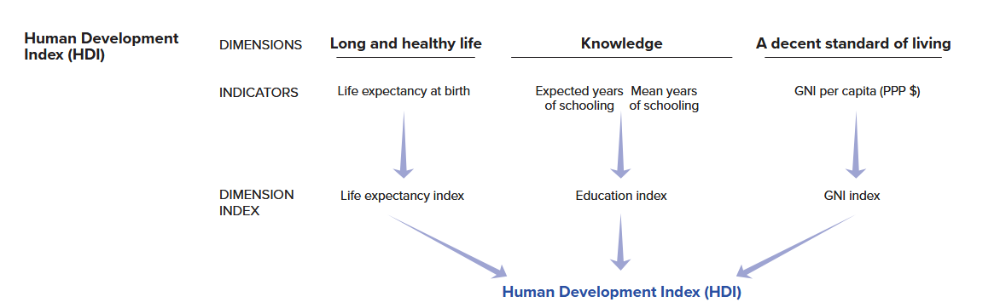

# Creating Indices / Scales {#sec-scales}

```{r}
#| message: false
#| warning: false
#| echo: false

#Packages
library(patchwork)
library(kableExtra) 
library(rio)            
library(tidyverse)      
library(broom) 
library(performance)
library(modelsummary)

# Datasets used in examples below
scale_data <- import("./data/scale_data.rda")
hdi_data <- import("./data/hdi_data.csv")
```

```{r}
#| eval: false

#Packages
library(patchwork)    # For combining plots together
library(kableExtra)   # For html table making
library(rio)          # Importing data    
library(tidyverse)    # Data management and plotting    
library(broom)        # Model coefficients
library(performance)  # Model and scale performance
library(modelsummary) # Descriptive statistic tables

# Datasets used in examples below
scale_data <- import("scale_data.rda")
hdi_data <- import("hdi_data.csv")
```

::: {.callout-note title="Who is this for?"}
You do not need to know how to perform these analyses for the assignments in Statistics II. Instead, this guide is for students writing their final paper in Data Skills or a BAP thesis project.
:::

It can sometimes be a good idea to combine variables together into a single index for use in statistical analyses, whether as one's dependent variable or as an independent variable. We may wish to explain variation in populist attitudes, for instance, where being a populist is understood as being anti-elitist, believing that public policy should follow the common will, and possessing a manichean (good vs. evil) understanding of political conflict.[^scales-1] Answering our research question may thus involve combining measurements of these three attributes together to form a final scale for analysis. We may also wish to combine items to obtain a more accurate measurement of a concept. Consider the final exam in Statistics II. We could ask you a single question to assess your statistics knowledge, but doing so would produce a less accurate estimate of how much you have learned in comparison to asking you multiple questions. Finally, combining items together can reduce the complexity of our statistical models and thereby enhance their parsimony; instead of including 10 independent variables, for instance, we might be able to include 5 in total (4 + an index of the remaining ones). This can be useful in situations where independent variables are highly correlated with one another such that including them in a model as separate variables would introduce a high level of multicollinearity into model estimates.

[^scales-1]: See @castanhosilva2020 for a discussion of different populism scales.

This appendix focuses on how to create indices based on multiple variables and the considerations that arise when doing so. The first section discusses some general considerations guiding the decision to make an index from multiple items. We then provide a worked example where we show how to assess the *reliability* of an index and then how to create indices either by taking the sum of multiple variables or their average. The second worked example will discuss what to do when the items you want to combine together do not have the same original scaling.

## General Considerations

The R data management steps we demonstrate in the sections below could be used to create an index from all sorts of measurements (variables) in your dataset. Of course, this does not mean that we should just start combining things together without any forethought. Instead, the decision to create an index should proceed in a thoughtful manner guided by broader considerations regarding the background concept and what a valid and reliable measurement of it would look like. We briefly touch on some of these considerations here.[^scales-2]

[^scales-2]: See, for instance, @adcock2001 for a deeper treatment of the concepts discussed here.

The natural starting point for our discussions is "conceptualization". We may wish to empirically study variation in "democracy" or "populism" or "ideology", etc. However, in order to do so we must come to some understanding of what these concepts mean based on past research and our own reasoning. Otherwise, how would we know what to look for in the first place?

Our next task is identifying appropriate indicators/measures/operationalizations of this concept. Here, we are looking for valid and reliable measurements regardless of whether we are relying on a single item or, in our examples below, an index of multiple indicators to measure our concept. However, this begs the question: What does it mean for an indicator (or scale) to be a valid or reliable measurement?

Validity is a continuous (e.g., measurements can be more less valid) and multi-dimensional (e.g., there are different elements of validity) concept. We would first ask whether a measurement (or scale) has "face" or "content" validity - do the items touch on all (or a representative set of) relevant aspects of the underlying construct we're interested in measuring? Does it look like the measures actually, well, measure the concept in question? A question asking someone whether they believe that "the people should have the final say on most important political issues" seems a valid measurement of (one aspect of) populist attitudes per the definition above, but not as a measure of "political participation". Second, we could think about the potential predictive validity of the measure or scale: does it predict things it should (convergent validity) and *not* predict things it *shouldn't* (discriminant validity)? Your judgments on this front will likely rely on the accumulation of available evidence from past research rather than your own attempts to validate a scale or item. In Example 1 below, for instance, we are relying on a large body of research on the nature of emotions which has validated the measurements we will use.

A second consideration is whether our indicators are *reliable* measurements of the underlying concept. A reliable measurement will consistently produce similar results in similar conditions. A classic example is that of a weight scale: if you place the same object on the scale over and over again, will you get the same weight measurement? You will if the weight scale is reliable. Reliability is not necessarily accuracy though. A weight scale that is always off by 1kg is reliable, but not accurate. We would say that the weight scale in this example produces *biased* estimates (i.e., systematically wrong estimates).

There are different ways that researchers assess the reliability of a measurement. They may look at test-retest reliability as in the weight scale example above. For instance, we might ask a sample of respondents a series of questions relating to populism and then re-interview them, and re-ask those questions, a few days later. If our measure is reliable then we should see a high correlation between responses on the two interviews (assuming that nothing dramatic has happened in the time between measurements to change the person's underlying populist attitudes). You will almost certainly rely on other researchers' efforts on this front. However, there is another way of assessing reliability that is particularly relevant when creating indices: internal reliability. Internal reliability concerns whether multiple items meant to measure an underlying concept "hang together", i.e., strongly correlate with one another. The more strongly a series of items correlate with one another, the more internally reliable the scale is said to be. We will show you how to assess internal reliability below.

## Example 1: Emotions and Campaign Engagement

### Our Data

Why do people engage in electoral campaign activities (e.g., volunteer time or money to a political campaign, attend campaign rallies, etc.)? One prominent account focuses on people's skills and resources: does the person have the time needed to volunteer, or the money to donate, or various types of civic skills that may facilitate taking action. However, people must also possess the motivation to act as well. Recent work suggests that *emotions* can play a powerful role in motivating people to take political action.[^scales-3] We will examine this idea with a subset of data taken from the 2024 American National Election Studies (ANES) as a means of showing how to think about creating an index in R.

[^scales-3]: See @Brady1995 for a classic account of the role of skills and resources in understanding political participation. Our focus on emotions is inspired by @Valentino2011 who examine motivation and campaign engagement in the US using data from an earlier ANES survey. Of course, emotions may also *demobilize* people as @Young2019 shows in her study of emotions and state repression in Zimbabwe.

The ANES is a social survey of a random sample of American adults. Respondents are first surveyed prior to the national elections in the US (pre-election) and then again right after the election is held (post-election). Respondents on the 2024 version of the survey were asked whether they had undertaken a number of different campaign specific behaviors on the post-election wave of the survey. Respondents were asked the following prompt followed by the questions below (with the name of the variable in the dataset in parentheses): "We would like to find out about some of the things people do to help a party or a candidate win an election. During the campaign..."

-   "Did you talk to any people and try to show them why they should vote for or against one of the parties or candidates?" (`persuade`)
-   "Did you participate in any online political meetings, rallies, speeches, fundraisers, or things like that in support of a particular candidate?" (`online_meetings`)
-   "Did you go to any political meetings, rallies, speeches, dinners, or things like that in support of a particular candidate?" (`rallies`)
-   "Did you wear a campaign button, put a campaign sticker on your car, or place a sign in your window or in front of your house?" (`campaign_button`)
-   "Did you do any (other) work for one of the parties or candidates?" (`other_work`)
-   "Did you give any money to a political party during this election year?" (`contribute_money_party`)
-   "Did you give any money to any other group that supported or opposed candidates?" (`contribute_money_group`)

Respondents could say "yes" or "no" to these questions. The former response is given a code of 1 and the latter a code of 0.

It is always a good idea to get to know your data before doing any sort of complicated analysis. We will thus use the `psych::describe()` function to get a quick overview of the descriptive data for these variables with the "mean" column telling us the proportion of respondents completing each action.

```{r}
scale_data |> 
  select(persuade:contribute_money_group) |> 
  psych::describe()  |> # <1>
  select(vars:mean, min, max) # <2>
```

1.  Using the `psych::` prefix eanbles us to use this function without loading the `psych` package. We do this because the `psych` package also contains other functions that conflict with `tidyverse` functions.
2.  Here we use the `select()` function to just show only some of the columns produced by `psych::describe()`. These are binary variables so some of the other columns produced by this command (e.g., skew, kurtosis) are less relevant to know about than if these were continuous variables.

Around 40% of respondents reported trying to persuade others about how to vote. At the same time, relatively few people (aprox. 3-14%) reported doing the other types of acts.

The items above will be the source of our dependent variable below. The ANES also asked respondents a battery of questions about their emotions with these questions being asked prior to the election. The questions possess a similar structure: "How \[emotion term\] do you feel about how things are going in the country?" The specific emotion terms asked about were:

-   hopeful
-   afraid
-   outraged
-   angry
-   happy
-   worried
-   proud
-   irritated
-   nervous

Respondents could choose from one of five response options: not at all (=1), a little (=2), somewhat (=3), very (=4), and extremely (=5). Let's take a quick look at the descriptive statistics for these variables:

```{r}
scale_data |> 
  select(hopeful:nervous) |> 
  psych::describe() |> 
  select(vars, n, mean, sd, median, min, max, skew, kurtosis)
```

One takeaway from this data is that these survey respondents were not feeling particularly positive about the state of things in the United States. On average, respondents reported feeling more anger, worry, irritation, etc., than hope, happiness, or pride. At the same time, there is a fair degree of variation on all items.

Our goal is to examine the relationship between emotions (independent variable) and campaign engagement (dependent variable). How should we do that?

One thing we could do is perform separate (logistic) models wherein we predict each engagement item with all of the emotions as predictor variables. This is appropriate if our goal is to separately analyze the different behaviors and emotional states, e.g., if we are interested in examining whether the individual emotions have similar relationships with different types of political acts. However, it may make sense to create indices for either the dependent and/or independent variable.

One the one hand, we might not be interested in predicting the individual behaviors but instead in understanding the *breadth* of campaign activity. Instead of examining whether feeling "proud" leads a person to be more likely to take some *particular* action, the goal of our paper may be in examining whether this emotion is associated with taking *more* actions rather than fewer. We will need to combine the items into a single index to accomplish this goal. We will show how to do this below.

On the other hand, we may have theoretical and empirical reasons for combining the emotions items into an index or, perhaps, more than one. Suppose that we regress either an individual campaign behavior item or a campaign engagement index on all of the emotion items at once. This would enable us to see whether there exists a relationship between, say, how "proud" one says they are and campaign engagement after adjusting for the effects of feeling "happy" and "hopeful" on campaign engagement. However, these words capture fairly similar (if not identical) emotional states that may very well go together (e.g,. someone experiencing pride may also experience happiness). Stated somewhat differently, someone feeling positively about the state of things in the US at the time of the election may be likely to report higher values on all three items to communicate their underlying positivity. Let's take a look at the correlations between the emotion items to see if that intuition has merit:

```{r}
#| tbl-cap: "Correlations between Emotion Items"
#| label: tbl-emotion-corr

scale_data |> 
  select(hopeful:nervous) |>  # <1>
  rename_with(str_to_title) |> # <2>
  datasummary_correlation() # <3>

```

1.  Selects just the items we want to produce correlations for.
2.  A shortcut! The column names are in lower case but we wanted them to be uppercase. We could have renamed them manually. But, here we use the `str_to_title()` function that is part of the `stringr` library (part of the `tidyverse`) to convert the columns to "title case", which automatically capitalizes the first letter of each word. Hat tip to [this](https://stackoverflow.com/questions/13258020/change-letter-case-of-column-names){target="_blank"} StackOverflow thread.
3.  Creates a correlation table. This function comes from the `modelsummary` package. See @sec-reporting-and-presenting-results for more on this command.

@tbl-emotion-corr shows the correlation coefficients for the emotion terms. As expected, "hopeful" is strongly correlated with both "happy" (*r* = 0.61) and "proud" (*r* = 0.60). "Happy" and "proud" are likewise strongly correlated with one another (*r* = 0.72). @tbl-emotion-corr shows something else important. The other items in the table (e.g., "afraid", "outraged", etc.) are positively correlated with one other but *negatively* correlated with the three positive emotion terms. ANES respondents who said they were angry (etc.) about the current state of affairs in the US tended not to say they were happy, which makes some intuitive sense. This suggests that we may be able to make our regression model simpler (more parsimonious) by creating two indices, one for the "positive" emotions and another for the "negative" emotions. This will help us avoid potential multicollinearity issues.

### Checking Scale Reliability

We discussed above how we should think about the validity and reliability of a scale before creating one. We return to these ideas here and show you how to investigate the internal reliability of a proposed index.

Our main concepts are "campaign engagement" and "emotions". The items described above certainly seem like they have face validity as measures of those concepts. Of course, we could wonder about whether there are additional elements to these concepts not being tapped by these particular measures. For instance, there are likely other types of campaign activities out there and certainly other types of emotions (e.g., disgust, shame, etc.). Does that matter for our eventual conclusions about emotions and campaign engagement? That would be a natural candidate for further discussion in the conclusion of our paper!

The preceding section ended by discussing the possibility of creating two emotion indices: one for the "positive" and one for the "negative" emotion items. Is that a reasonable decision? On this front, we could justify our decision in part based on existing work in this area and specifically a prominent theoretical model of emotions called "affective intelligence theory" which argues that human cognition and behavior is supported by two emotional systems. Not coincidentally, these items are included in the ANES to help test this broader theoretical perspective.[^scales-4] In your examples you would perhaps also be able to justify your decision to combine items in relation to existing work and your efforts to clearly conceptualize the concept(s) at the heart of your paper.

[^scales-4]: See @Marcus1993 for the early landmark study on this front. Subsequent work, including @Valentino2011, further divides the negative emotion dimension into two: one pertaining to "anxiety" (e.g., feeling "afraid") and the other to "aversion" (e.g., feeling "angry"). Measurements of these two emotional states are often highly correlated although sometimes they are more clearly differentiated (e.g., some people might feel much more angry than afraid after a political event while others might feel much more afraid than angry). In such cases it can be important to clearly differentiate between anger and anxiety as they can have distinct political effects; see @Vasiopoulos2019 for an example.

What about reliability? Would creating an index of the "positive" emotion items yield an internally reliable index, for instance? We can begin investigating this question by considering the inter-correlations between the various items of a proposed scale, much as we did above. These analyses suggest that a scale of the positive, and one for the negative, emotion terms would be reliable given the strong correlations between items seen in @tbl-emotion-corr. While examining the inter-relationships between items via an investigation of their correlation coefficients is a good start, there are nevertheless two complications in making a final judgment based purely on that information: (1) there may be lots of correlations to consider and (2) how do we know if the inter-correlations are *strong enough* to justify creating an index?

On this front, researchers creating an index will typically report a summary measure of scale reliability known as Cronbach's alpha ($\alpha$). The calculation of $\alpha$ is based in part on the average degree of covariance between the various items in the scale.[^scales-5] The $\alpha$ measure ranges from 0-1 with higher values indicating a more reliable index. A score of 0 would essentially indicate that the items are unrelated to one another while a score of 1 would indicate perfect correlation between all of the items. Researchers often use the following rules of thumb when interpreting $\alpha$ scores:

[^scales-5]: A more specific formula is: $\alpha = \frac{k\bar{c}}{\bar{v} + (k - 1)\bar{c}}$. $k$ = the number of items. $\bar{v}$ = the average variance of the items. $\bar{c}$ = the average covariance between the items.

-   $\geq$ 0.90: Excellent reliability
-   0.80-0.89: Good reliability
-   0.70-0.79: Acceptable reliability
-   0.60-0.69: Questionable reliability
-   \< 0.60: Poor reliability

A proposed index with a $\alpha$ below 0.6 is generally considered a poor candidate for creation. However, we note an important caveat here. While one can calculate an $\alpha$ score for an index comprised of binary indicators, this will generally lead to under-estimates of reliability because $\alpha$ assumes interval/continuous data. There are more advanced methods for investigating the reliability of indices based on binary data, but they go belond the scope of this book.

We can obtain the $\alpha$ score for a proposed index via the `cronbachs_alpha()` function from the `performance` package.

```{r}
# Behavior index
scale_data |> 
  select(persuade:contribute_money_group) |> # <1>
  cronbachs_alpha() # <2>

# Positive Emotions
scale_data |> 
  select(hopeful, happy, proud) |> 
  cronbachs_alpha()
  
#Negative Emotions
scale_data |> 
  select(afraid, outraged, angry, worried, irritated, nervous) |> 
  cronbachs_alpha()

```

1.  Select the variables we want to obtain an $\alpha$ score for. We separate column names via a : here because these columns are adjacent to one another in our data. We are thus telling R to select all columns between `persuade` and `contribute_money_group`. If that were not the case, then we would have to separately identify the columns as in the other two examples.

The $\alpha$ scores for the two emotion scales are 0.84 and 0.93 respectively. This indicates that both scales are highly reliable. The reliability for the negative emotions scale is greater in large part due to the presence of more items. At this point we feel comfortable creating two separate scales based on these emotion items. The $\alpha$ score for the behavior index, meanwhile, is lower at 0.63. This is below the often used 0.70 rule of thumb for judging a scale as being reliable. However, $\alpha$ scores will be attenuated when the scale is comprised of binary variables, as we noted above. In our case, then, we feel comfortable using the scale of these items.

### To Sum or to Average?

We will create three indices: one for campaign behavior and two for the emotions. The next question we confront is this: *how* should combine these items together? We could either *sum* the items in the index up or alternatively *average* them together. Which method should we use?

There is not necessarily a "right" answer to the foregoing question as the decision to sum vs. average will depend on the specifics of the items and your goals. Summing indicators makes more intuitive sense when the goal is to examine the total or count of something. Averaging, on the other hand, makes more sense when we want to maintain the original scaling of the items for our index. We could add up all of the emotion items above but this would lead to scales with different ranges (e.g., the negative emotions scale is based on six items and hence an additive scale would range from 6 to 30 while an additive positive emotions scale would range from 3 to 15). Averaging the items, meanwhile, would produce scores on a 1-5 scale for both indices and one that is easier to interpret. What would a score of 20 really represent on a summed scale of the negative emotion items? On the other hand, a 4 on a scale created by averaging the different emotion items together is a bit easier to interpret in this case (e.g., the person tends to say "very" to each of the questions).

Another consideration to think about concerns missing data and is particularly important when thinking about summative indices. When we tell R to take a mean or a sum of something we need to tell it how to handle missing data via `na.rm = TRUE` or `na.rm = FALSE`. The former command tells R to remove missing observations before performing the calculation while the latter tells R not to do that. We need to use `na.rm = TRUE` to calculate a mean or take a sum as otherwise the command will return "NA" as this example shows:

```{r}
# Some data for the example
x <- c(5, 1, 2, NA, 5)

# Taking a mean
mean(x, na.rm = TRUE)
mean(x, na.rm = FALSE)
```

If we form an index by averaging together multiple items, then the resulting average will be based only on those items for which you have data. If your index is created by taking the average of five items but an observation is missing data on one of the observations, then the index score for that observation will be based on the four items for which there is data. This is generally okay.

What if we are taking a sum? We again need to set `na.rm = TRUE` in order to obtain a non-NA outcome. However, we have to be careful here. When we use `na.rm = TRUE` with `sum()`, the command will work by giving a score of 0 to any observation with an NA value in order to calculate the final scale item for the observation. This can lead to some unintended effects if we have observations without *any* data on the variables used to calculate the scale. Consider this example where we create a dataset with two variables, x and y. The x column is entirely comprised of NA responses, while the y column has a single NA. We then take the sum of both columns.

```{r}
# Toy data
data <- tibble(
  x = c(NA, NA, NA, NA, NA), 
  y = c(0, 1, 0, 0, NA)
)

# Take a look
data

# Sum up the columns
data |> 
  mutate(sum_x = sum(x, na.rm = T), 
         sum_y = sum(y, na.rm = T))
```

The sum of the x column is 0...even though there is no actual data to sum. We are, in some sense, imputing data for this "case" in our data which could be quite problematic. The campaign engagement measures used in Example 1, for instance, were asked on the post-election wave of the ANES survey. However, not all respondents took part in the post-election survey. If we did not take that into account in some manner, then creating a summative indicator for campaign engagement would give each of those respondents a score of 0 on a scale to which they couldn't even give a response! We filtered out those respondents from our dataset when creating it for this example, so we do not need to worry about this happening, but there may still be individuals in our dataset that completed the survey but nevertheless failed to answer all of the engagement items.[^scales-6] We will show how to find these types of observations and how to deal with them below.

[^scales-6]: Respondents could refuse to answer the engagement questions or say they "don't know" as well. These respondents are coded as missing. If a respondent refused to answer all items, for instance, then they would be missing on all measures.

### Creating the Scales

The basic tools needed to create an index in R are ones that you have encountered before: `mean()` and `sum()`.[^scales-7] If you have used these tools previously, then you have used them on one column at a time, e.g,. to find the mean or total of a single variable. Creating an index, however, requires us to combine *multiple* columns *together*. There are different ways we can accomplish this end but here will rely on some new commands that are part of the `tidyverse`: `rowwise()` and `c_across()`. These tools are meant for the types of operations we are going to perform below. You can learn more about these tools via the following [vignette](https://dplyr.tidyverse.org/articles/rowwise.html){target="_blank"} as well.

[^scales-7]: You shouldn't try and create an index by manually adding together or averaging together columns (e.g., `newvar = var1 + var2 + var3`). This can work if there is no missing data at all in the dataset, but soon breaks down in more realistic situations where observations have missing values on one or more of the variables that are being combined together.

#### An Index via averaging

We'll begin by creating two indices: one where we average together the three positive emotions items and one where we average together the six negative ones.

```{r}
scale_data <- scale_data |> 
  rowwise() |> 
  mutate(
    positive_emotions = mean(c(hopeful, happy, proud), na.rm = T), 
    negative_emotions = mean(c(afraid, outraged, angry, worried, 
                               irritated, nervous), na.rm = T)) |> 
  ungroup()

```

Here is how to read the syntax:

`scale_data |> rowwise() |>`

:   The new command here is `rowwise()`. The vignette linked to above provides a succint explanation for what this is doing: "If you use `mutate()` with a regular data frame, it computes the mean of x, y, and z across all rows. If you apply it to a row-wise data frame, it computes the mean for each row." In other words, when we specify `rowwise()`, we tell R to then perform subsequent operations on each row separately.

`mutate(positive_emotions = mean(c(hopeful, happy, proud), na.rm = T), ...))`

:   We then tell R to add new columns to our dataset via `mutate()`. The first variable we are creating is to be named `positive_emotions`. This should be the product of the `mean()` function. The main difference here from what you have seen elsewhere is the `c(hopeful, happy, proud)` and `c(afraid, outraged, ..., nervous)` entries. What we are doing here is telling R which columns in our dataset to average across. Finally, `na.rm = T` tells R to ignore missing values when calculating the average.

`ungroup()`

:   This tells R to ungroup the data - to undo the `rowwise()` element of the syntax. This is done to avoid accidentally doing future operations (e.g., future `mutate()` commands) row-by-row.

Here is a glimpse at our data including the new columns:

```{r}
scale_data |> 
  select(hopeful:negative_emotions) |> 
  head() |> # <1> 
  kable(digits = 2) # <2>
```

1.  Automatically selects the first few rows of data for presentation.
2.  `kable()` is a common tool for creating tables in html files. We use it here make sure all columns are shown to you.

The first respondent was very unhappy about the state of affairs in America: they gave a score of 1 on each positive emotion item (and hence have an average of 1 on the index) and a score of 5 on all negative ones (and hence an average of 5 on the index). Respondent 6 was nearly the exact opposite on this front while the other respondents shown in this output are somewhere in the middle.

We can get a sense of the inter-relationship between the scales by looking at their bivariate correlation:

```{r}
cor.test(scale_data$positive_emotions, 
         scale_data$negative_emotions, 
         method = "pearson")

```

The two items have a moderate negative correlation. However, the correlation is not a perfect one such that many respondents could perhaps be described as feeling "ambivalently" about the state of things in the US on the eve of the 2024 Presidential election (i.e., a mixutre of positive and negative emotions).

#### An Index via summing

A very similar process can be used to create summative indices in R. However, one thing we should first do is check to see if there are any observations with entirely missing data on the variables comprising the index that we want to create. We can do this as so (although, as we show you below, there is a simpler way to specify the variables in this command that would be useful here):

```{r}
scale_data <- scale_data |> 
  rowwise() |> 
  mutate(engage_missing = sum(is.na(c(persuade, online_meetings, rallies, 
                                      campaign_button, other_work, 
                                      contribute_money_party,
                                      contribute_money_group)))) |> 
  ungroup()
```

`sum(is.na(c(persuade, ..., contribute_money_group))))`

:   As above, we use `rowwise()` followed by a `mutate()` command. Here we are interested in counting how many observations are missing data on our 7 measures of campaign engagement so we use the `sum()` function. We specifically want to know if the observation has missing data. We use the `is.na()` function to accomplish this goal. `is.na()` here will essentially convert the columns in the `c()` portion of the command into binary variables where 0 = non-missing and 1 = missing data with `sum()` then finding the total.

We can next look to see if there are any observations with missing data on all 7 columns via a simple `table()` command:

```{r}
table(scale_data$engage_missing)
```

The vast majority of observations has full data (i.e., 0 missings). Only one observation has complete missing data on these items. We can filter this observation out of our data to make sure that we do not give it an inaccurate scale estimate later on:[^scales-8]

[^scales-8]: An alternative here might be to use the `complete.cases()` command much as one does when using the `anova()` command to compare models (as seen in @sec-linear-comparing-models). This would get rid of all observations with complete missing data. It would also remove the obervations with some (but not complete) missing data as well (e.g., those observations where data is missing on one or two items). We opted for this approach to keep as much data in our model as possible. In doing so we are, in essence, assuming that someone with missing data on a single item has not done this action. Note that the approach here could also be useful for restricting the construction of the scale to only those observations with a certain number of non-missing values. For instance, we could filter out observations with missing data on 4 or more of these variables before creating our scale.

```{r}
scale_data <- scale_data |> 
  filter(engage_missing < 7)  
```

We can finally turn to creating our index. Here we will introduce a handy shortcut that we can use here: `c_across()`:

```{r}
scale_data <- scale_data |> 
  rowwise() |> 
  mutate(campaign_engagement = sum(c_across(persuade:contribute_money_group))) |> 
  ungroup()
```

`campaign_engagement = sum(c_across(persuade:contribute_money_group)))`

:   Earlier we manually listed all of the columns we either wanted to average together or add together via `c()`. This works, but can be a bit cumbersome if there are many columns to write out. We can instead simplify our life by telling R to sum together all columns in a sequence by separating the first column and the last with a colon (`persuade:contribute_money_group`). This will only make sense/work, though, if this sequence of columns does not include variables we *don't* want in our index; if there were columns like that in the sequence (e.g., if `hope` came after `persuade` in our data), then they would also be included in the final scale. In those situations we can always use the `c()` method seen in earlier examples.

Let's take a look at distribution of the final index:

```{r}
table(scale_data$campaign_engagement)
```

The vast majority of respondents completed either 0 or 1 of the campaign activities. Only 11 respondents, meanwhile, took part in all 7 activities.

### Let's Run a Model!

Now that we have created our indices, we can of course analyse them with a regression model. Here we'll perform a linear regression predicting the campaign engagement measures based on the two emotion indices:[^scales-9]

[^scales-9]: OLS models are not necessarily the most appropriate statistical model for analyzing count data such as this. However, the more appropriate models (poisson regression and negative binomial models) are beyond the scope of this book and an OLS regression will work just fine in a pinch.

```{r}
# Model 
engagement_model <- lm(campaign_engagement ~ positive_emotions + negative_emotions, 
                       data = scale_data)

# Coefficients
tidy(engagement_model)
```

There exists a positive, and statistically significant, relationship between both indices and campaign engaegment. ANES respondents that reported stronger emotional reactions to current events also tended to report engaging in more campaign behaviors than those with weaker ones and this occurs regardless of whether we are considering positive emotions such as hope as negative ones such as anger.

## Example 2: Items with Different Scales

The scales we created above used items that had the same scaling (i.e., all binary items in the campaign engagement index or items that all ranged from 1 to 5 in the emotion indices). However, you might want to / need to create indices from items on very different scales. We'll discuss how you can accomplish this end in the following sub-sections.

### Two Approaches: Normalization and Standardization

Our second example will focus on a measure known as the human development index (HDI). The [HDI index](https://hdr.undp.org/data-center/human-development-index#/indicies/HDI){target="_blank"} is "a summary measure of average achievement in key dimensions of human development: a long and healthy life, being knowledgeable and having a decent standard of living". It is created by combining together country-level data: life expectancy in years, educational attainment (based on the expected years of schooling and the mean years of schooling achieved in the country), and country wealth via the natural logarithm of gross national income (GNI) per capita. This image is taken from the UN's technical documentation regarding the report and summarizes the creation of HDI:

{fig-alt="An image showing the main components of HDI: life expectancy, educational attainment, and gross national income."}

Our goal in the following sections is to create an HDI scale ourselves using the underlying data used by the UN for the year 2023, which we obtained from their [website](https://hdr.undp.org/data-center/documentation-and-downloads){target="_blank"}. Here is an overview of the four variables that are used to construct the HDI index: life expectancy at birth in years (`life_expectancy`), the expected years of schooling in the country in years (`expected_schooling`), the mean years of schooling in years (`mean_schooling`), and gross national income (which has been logged; `gni_percap_logged`):[^scales-10]

[^scales-10]: The UN first takes some data cleaning steps before calculating the HDI index that we also performed when creating this datafile. For instance, the life expectancy variable was recoded such that countries with a life expectancy greater than 85 years were given a score of 85 and those with a GNI below 100 were given a value of 100 before taking the natural logarithm. If you would like to know more about the reasoning behind these recoding decisions, then we recommend the Technical Notes document that you can find on the [documentation](https://hdr.undp.org/data-center/documentation-and-downloads){target="_blank"} page for this measure as well as their "Calculating the Indices" tool (also provided on this webpage).

```{r}
datasummary(life_expectancy + expected_schooling + mean_schooling + gni_percap_logged ~ 
              Mean + SD + Min + Max + N, data = hdi_data)

```

We can clearly see that the variables are on very different scales. Life expectancy ranges from 54 to 85, for instance, whereas the mean years of schooling achieved measure ranges from 1.41 to 14.30. As a result, if we simply averaged these variables together to create our scale we'd end up with a hard to understand index.

How can we create a meaningful index from these differently scaled items? In situations like this researchers will first rescale the variables in question to place them on the same scale before creating their index. There are two common tactics here: normalization and standardization.

Normalization involves rescaling variables so that they have the same minimum and maximum values. The following formula will rescale a variable to a 0-1 range where 0 = the minimum value on the original variable and 1 = the maximum value on the original variable. If we wanted to scale the variable to 0-10 (for instance), then we could simply multiply this output by 10.

$$\text{(0-1) Normalized Variable} = \frac{X_{i} - min(X)}{max(X) - min(X)}$$ The HDI scale is created using a normalization process much like this although the UN sets the minimum and maximum values for some of the rescaled variables at pre-chosen values instead of the minimum and maximum values observed in the data. For instance, they rescale the life expectancy variable using this formula but use 20 and 85 as the minimum and maximum values in the equation. They do so because "no country in the 20th century had a life expectancy at birth of less than 20 years" and "85 \[is\] a realistic aspirational target for many countries over the last 30 years." They do something similar for GNI per capita, setting a minimum of log(\$100) and a maximum of log(\$75000). They rescale their education variables in a simpler manner: they code all countries with either 18+ (expected schooling) or 15+ (mean years of actual schooling) years to 18 and 15 and then divide the variables by 18 and 15 respectively to normalize the variable. We will show you how to manually calculate normalized scales below using these values to maintain fidelity to the UN's approach. We will also show you how to normalize variables using a command from the `scales` package (`rescale()`) that will automatically find the minimum and maximum values of a variables and which will be more generally useful.

Normalization is a common way of rescaling a variable whether we are simply using that variable as is in our regression model or we are combining it with other variables in a scale. Normalization has a few advantages. It makes sure that all (rescaled) variables have the same range. Importantly, it can also be used with different types of variables such as interval/ratio, ordinal, and binary variables. At the same time, normalization does not standardize the variance of the variables being combined together. This can have the consequence of variables with relatively less variance contributing less to an observation's score on the final scale.

An alternative way approach would be to first standardize the variables in question before combining them together:

$$\text{Standardized Variable} = \frac{X_{i} - \bar{X}}{\text{Std. Dev}(X)}$$

Here, we subtract the mean of the variable from each observation and then divide by the standard deviation of the variable. The resulting standardized variable is centered at 0 with 0 indicating an average score on the original variable. Deviations from 0 are expressed in standard deviations. This standardizes the variation of all items thereby enabling them to contribute equally to the final index regardless of their original variance. However, it also changes the interpretation of values in an important sense. Suppose that a variable has a positive value on a standardized variable. This tells us that the observation has an above average score on this variable. However, it is possible that the average value of the originating variable is actually quite low such that "above average" doesn't equate to having a "high" value in terms of the original scaling of the variable. Regardless, standardization can be a powerful way of creating indices from items with different scales and especially so with interval/ratio variables.

### Creating and Investigating the Indices

We'll create versions of the HDI index using both normalization and standardization in the sections below. We'll then compare the two measures against one other to see how they are alike and how they differ.

#### Normalization

HDI is calculated by averaging together three normalized variables: life-expectancy, the average of the two education measures discussed above, and the log of GNI per capita. We will show you how to normalize variables manually, using the formula shown earlier, and using the `rescale()` command from the `scales` packake. This latter approach is what we would generally recommend taking, but we also want to show the manual approach to show the underlying process and to be as faithful as possible to the specific methods used by the UN in creating this scale.

The first step we will take is finding the average of the two education measures used in calculating HDI. The UN first divides the measures by 18 and 15 respectively to create a 0-1 scaling and then takes the average of the two items. We accomplish this via the syntax shown below which uses the same `rowwise()` technique from above to find the average of the two variables.

```{r}
# Create the education index for use later on
hdi_data <- hdi_data |> 
  mutate(
    expected_yrs_rescale1 = expected_schooling / 18, 
    mean_yrs_rescale1 = mean_schooling / 15) |> 
  rowwise() |> 
  mutate(
    education_index_1 = mean(c(expected_yrs_rescale1, mean_yrs_rescale1), na.rm = T)
  ) |> 
  ungroup()

# Check the distribution
summary(hdi_data$education_index_1)

# Look at the data
hdi_data |> 
  select(expected_schooling, expected_yrs_rescale1, 
         mean_schooling, mean_yrs_rescale1,
         education_index_1) |> 
  slice_head(n = 5) |> 
  kable(digits = 2)

```

The final index variable ranges from 0-1 with a minimum of 0.25 and a maximum of 0.96. We can follow the calculation of the index by looking at the relevant variables in the dataset. The first observation shows the maximum of 18 years of expected education. If we divide this by 18, then we get the maximum value of 1 on `expected_yrs_rescale1`. However, this observation does not have the maximum value on `mean_schooling`, but instead 13.9. If we divide this number by 15, then we get a value close to the maximum of 1: 0.93. The average of 1 and 0.93 can be found under `education_index_1`.

Our next step will be to normalize the life-expectancy and (log of) GNI per capita measures. The UN uses custom minimum and maximum values in doing so: 20 and 85 for life expectancy and log(100) and log(75000) for GNI per capita.

```{r}
# Normalize these variables
hdi_data <- hdi_data |> 
  mutate(
    life_rescale1 = (life_expectancy - 20) / (85 - 20), 
    gni_rescale1 = (gni_percap_logged - log(100)) / (log(75000) - log(100)))

# Check the distributions
summary(hdi_data$life_rescale1)
summary(hdi_data$gni_rescale1)

```

When normalizing the variables we subtracted the UN supplied minimum value from each obervation's value on the variable and then divided this value by the difference between the UN supplied maximum and minimum values. We can see from the output of the `summary()` command that we have now put these variables on a scale ending in 1, although here the minimum values are not 0 exactly.

Finally, we can create our index by averaging these together using the same tools (`rowwise()` and `mean(c(), na.rm =T)`) as earlier.[^scales-11]

[^scales-11]: We are using the simple average of these items here, but the UN uses the geometric mean of the values so our final results do not exactly match the UN's HDI calculation. The `psych` package has a function for calculating the geometric mean.

```{r}
# Create the scale
hdi_data <- hdi_data |> 
  rowwise() |> 
  mutate(hdi_normalize_un = mean(c(life_rescale1, gni_rescale1, 
                                   education_index_1), na.rm = T)) |> 
  ungroup()

# Its distribution
summary(hdi_data$hdi_normalize_un)

```

Our final scale ranges from 0.41 to 0.97 with higher values indicating higher levels of educational attainment, country wealth, and life expectancy.

The process above used custom minimum and maximum values from the UN. The UN justifies these values based on theoretical considerations. In your own examples, though, it will be simpler to use (and justify) the actual observed minimum and maximum values for the variables in your dataset rather than specifying (potentially arbitrary) values of your own. Here, we can use the `scales::rescale()` command to accomplish our goals. We will first normalize all four variables using this method before creating the final scale.

```{r}
hdi_data <- hdi_data |> 
  mutate(
    expected_yrs_rescale2 = scales::rescale(expected_schooling, to = c(0,1)), # <1>
    mean_yrs_rescale2 = scales::rescale(mean_schooling, to = c(0,1)), 
    life_rescale2 = scales::rescale(life_expectancy, to = c(0,1)), 
    gni_rescale2 = scales::rescale(gni_percap_logged, to = c(0,1)))

```

1.  We use the prefix here (`scales::`) so that we can use this function without loading the library in question. The `scales` library is great, but it can conflict with other libraries in use in our document. Otherwise, we could simply load `scales` first and then our other packages.

Here is how to read the syntax.

`scales::rescale(`

:   The syntax here has a common structure so we will simpy focus on this first example. The name of the command is `rescale()` although we include a prefix here (`scales::`) to tell R that we want to use this command without loading the library (`scales`) in question. We do this to avoid potential conflicts with other packages.

`expected_schooling, to = c(0,1))`

:   We next provide the name of the variable we want to rescale. We end with `to = c(0,1)`. This tells the command that we want to rescale th evariable to a 0-1 interval. We could specify other values as well (e.g., `c(0,10)` would scale to a 0-10 interval).

Let's take a quick look at the original life expectancy measure and how the two rescaled versions relate to it and to each other:

```{r}
# Original and UN measure
p1 <- ggplot(hdi_data, aes(x = life_expectancy, y = life_rescale1)) + geom_point() + 
  scale_y_continuous(limits = c(0,1)) + 
  labs(title = "Normalization using UN\nprovided min(x) and max(x)") # <1>

# Original and scales::rescale()
p2 <- ggplot(hdi_data, aes(x = life_expectancy, y = life_rescale2)) + geom_point() + 
  labs(title = "Normalization via\nscales::rescale()")

# Combined plot using the patchwork library
p1 + p2 

```

1.  `\n` here adds a linebreak to the title.

Both normalized variables range between 0 and 1. However, we can see that the minimum value of the variable we created using `scales::rescale()` is exactly 0 while the minimum for the version created using the UN's rules is higher at just north of 0.5 (0.53). Why did this happen? `scales::rescale()` will use the observed minimum and maximum values of the variable in the dataset when normalizing. An observation with the minimum observed value on the variable being rescaled will have a value of 0 on the new variable while one with the maximum observed value will have a score of 1 as we can see from the plot on the right. The UN approach set the minimum values for life expectancy and GNI per capita at specific values that do not match the actual observed minimums in the dataset. The actual observed minimum for life expectancy, for instance, is 54.26 rather than the UN supplied 20. This leads to higher values at the lower end of the scale.

Returning to our `scales::rescale()` normalized variables, we can finally create the index much as above:

```{r}
# Creating the index using the scales::rescale() normalized variables
hdi_data <- hdi_data |> 
  rowwise() |> 
  mutate(
    education_index_2 = mean(c(expected_yrs_rescale2, mean_yrs_rescale2), na.rm = T),
    hdi_normalize_scales = mean(c(education_index_2, life_rescale2, gni_rescale2), na.rm = T)
    ) |> 
  ungroup()
```

How does this scale compare to the version using the UN supplied values?

```{r}
# Comparing the two versions
summary(hdi_data$hdi_normalize_scales) # scales::rescale() normalization
summary(hdi_data$hdi_normalize_un) # normalization using UN provided values

# Correlation
cor.test(x = hdi_data$hdi_normalize_un, 
         y = hdi_data$hdi_normalize_scales, 
         method = 'pearson')
```

The two scales both range continuously between 0 and 1 although the values are not exactly identical given the use of different minimum and maximum values in the normalization process. The UN version leads to higher values at the lower end of the scale because the observed minmum values in the dataset are larger than the UN supplied minimums. Even so, the two scales correlate at 0.998, so these differences are unlikely to matter much when we use them in our statistical models.

#### Standardization

We standardize a variable by subtracting the mean of the variable from an observation and then dividing that value by the variable's standard deviation. We can use the `scale()` command to accomplish this goal. This command is built into R, so you do not need to load a library to use it.

```{r}
# Standardizing
hdi_data <- hdi_data |> 
  mutate(
    life_std = scale(life_expectancy, center = TRUE, scale = TRUE), 
    expected_yrs_std = scale(expected_schooling, center = TRUE, scale = TRUE), 
    mean_yrs_std = scale(mean_schooling, center = TRUE, scale = TRUE), 
    gni_std = scale(gni_percap_logged, center = TRUE, scale = TRUE)
  )
```

Here is how to read the syntax:

`scale(`

:   The name of the command is `scale()`.

`life_expectancy, center = TRUE, scale = TRUE)`

:   We then provide the name of the variable we want to standardize. We further tell the command to center the variable (subtract the mean from each observation) via `center = TRUE` and to standardize it by dividing by the standard deviation via `scale = TRUE`.

Let's take a look at the properties of the resulting variables:

```{r}
# Take a look
hdi_data |>
  select(life_std, expected_yrs_std, mean_yrs_std, gni_std) |>
  psych::describe() 
```

We can see that all variables now have a mean of 0 and a standard deviation of 1. Their min and max values are not identical, but the values on these standardized variables have the same meaning (i.e., how much does the observation differ from the average).

Finally, we will create our index by simply averaging the four values together:

```{r}
# Create the scale
hdi_data <- hdi_data |> 
  rowwise() |> 
  mutate(
    hdi_standardized = mean(c(life_std, expected_yrs_std, 
                              mean_yrs_std, gni_std), 
                            na.rm = T))

# Take a look at its values
summary(hdi_data$hdi_standardized)
```

The resulting scale ranges from -2.12 to 1.44 with an average or mean value of 0. Observations near the maximum of this scale will have above average scores on all (or nearly all) of the items that were the basis for the resulting scale.

## References
